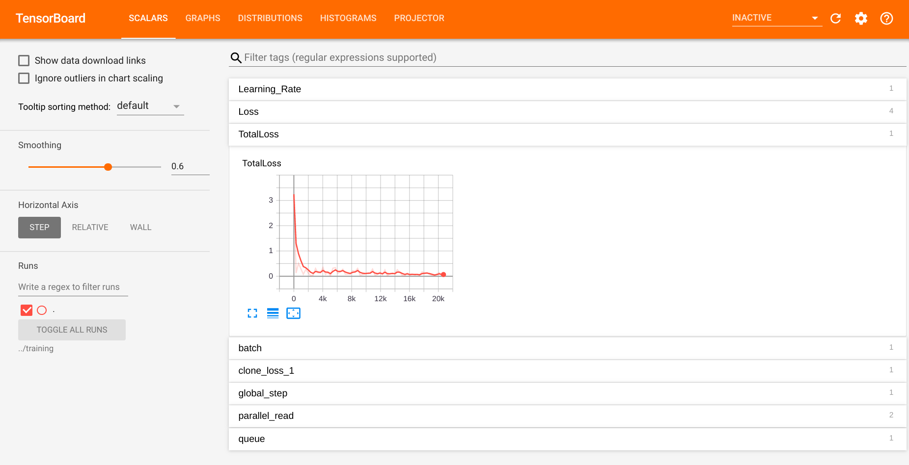
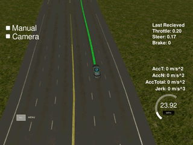
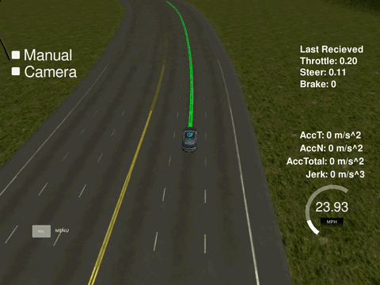

# Self-Driving Car Engineer - Final Project

Final (Capstone) Project of [Udacity's Self-Driving Car Engineer Nanodegree](https://www.udacity.com/course/self-driving-car-engineer-nanodegree--nd013) Program

## Introducing

The goal of the project is to encapsulate the whole gained knowledge of the "Self-Driving Car Engineer"-Nanodegree course from Udacity and use it to control a real-driving-car on a test-track in San Francisco - California.
The project includes the usage of the [Roboter-Operating-System](https://en.wikipedia.org/wiki/Robot_Operating_System) (short: ROS) which is a framework mostly used in the fields of robotics and autonomous systems.


## Team
The project was proudly developed by the following contributors (in alphabetical order).

| *Name*: | Adam Gyarmati | Gaurav Asati | Kevin Hubert | Lukas Leonard Köning |
|:---:|:---:|:---:|:---:|:---:|
|      *Team role*       |                          Developer                           |                          Developer                           |                     Developer & Teamlead                     |                          Developer                           |
|      *Time zone*       |                  GMT-8<br />(San Francisco)                  |                            GMT+5                             |                     GMT+1<br />(Berlin)                      |                     GMT+1<br />(Munich)                      |
| *GitHub profile image* | [](https://github.com/gyadam) | [](https://github.com/gasatig) | [](https://github.com/KevinHubert-Dev) | [](https://github.com/LukasLeonardKoening) |

** *Click on the picture of the respective person to view their GitHub profile.*

---

## Setup

We recommend to use the Docker container provided by Udacity. To do so, first build the docker container and then run the docker file:

```sh
# Ensure that you are in the directory including the provided Dockerfile
# Build
docker build . -t capstone

# Run
docker run -p 4567:4567 -v $PWD:/capstone -v /tmp/log:/root/.ros/ --rm -it capstone

# Setup the Docker container
chmod +x setup_docker.bash
./setup_docker.bash
```

To run the server-program on your local environment:

``` sh
# Clone this repository

git clone <Repository>
cd <Repository-Folder>

# Install requirements
pip install -r requirements.txt

# Build project and source ros-enviroment-variables
cd ros
catkin_make
source ./devel/setup.bash

# Launch
roslaunch ./launch/styx.launch
```

To see the result you need to download the [simulator](https://github.com/udacity/CarND-Capstone/releases) (we have tested it using version 1.3) and run it. Ensure that port 4567 is free to use.

---

## References and additional reading material

The following references/links/papers gave us inspiration and helped us to solve the project.

- [Faster R-CNN paper](https://arxiv.org/pdf/1506.01497.pdf): Original paper of Faster R-CNN
- [Review: Faster R-CNN (Object Detection)](https://towardsdatascience.com/review-faster-r-cnn-object-detection-f5685cb30202): A brief explanation of Faster R-CNN 
- [Tensorflow detection model zoo](https://github.com/tensorflow/models/blob/master/research/object_detection/g3doc/detection_model_zoo.md): A list of pre-trained models for detection and classification in a single network.
- [Tutorial - TensorFlow image recognition and object detection api](https://missinglink.ai/guides/tensorflow/tensorflow-image-recognition-object-detection-api-two-quick-tutorials/): Tutorial how to train existing detection and classification networks for own different data-sets.

We used data for the Traffic Light Detection from following sources:
- Alex Lechner's [GitHub repository](https://github.com/alex-lechner/Traffic-Light-Classification) ("The Lazy Approach")

More about the Self-Driving Car Engineer Nanodegree Program at Udacity can be found here:
[Become a Self-Driving Car Engineer](https://www.udacity.com/course/self-driving-car-engineer-nanodegree--nd013)

---

## Documentation

In this documentation the structure and the way how we achieved the goal (control the car) is briefly explained. The README and documentation was written by all members (especially for their own part of the project) and reviewed by Lukas Leonard Köning.

### Table of Contents

1. ROS System Architecture
2. Traffic Light Detection
3. Waypoint Updater
4. Drive-By-Wire

### 1.) ROS System Architecture


The image above shows the system architecture of our implementation. There are three main subsystems in an autonomous vehicle architecture: Perception, Planning, Control. The perception subsystem processes sensor information (like camera images, LiDAR point clouds or IMU data) to information that can be used by the planning subsystem. The planning subsystem takes in this information and decides what the car should do. It creates trajectories for the control subsystem. The control subsystem takes in this information, uses different controllers to create throttle, break and steering commands and sends them to the components of the car. 

Our task was to implement the Traffic Light Detection Node, the Waypoint Updater Node and the DBW Node. These are explained in the next sections in more detail.

### 2.) Traffic Light Detection


The Traffic Light Node is responsible for handling the traffic lights. It subscribes to the `base_waypoints` ROS topic (all waypoints of the track), the `image_color` ROS topic (image stream of the camera) and the `current_pose` ROS topic (position data to determine the current location). We also used the `/vehicle/traffic_lights` ROS node for testing purposes which delivers us information about all traffic lights from the simulator. The Traffic Light Node only publishes the index of the waypoint of the next upcoming red light's stop line to the `traffic_waypoint` ROS topic.

We used a Neural Network approach to the traffic light detection and classification problem. Initially we implemented [RetinaNET](https://towardsdatascience.com/review-retinanet-focal-loss-object-detection-38fba6afabe4) which worked really good but unfortunately is not compatible with the TensorFlow version (1.3) required by the real testing vehicle (Carla). So we went a step back to an older approach to the problem: Faster R-CNN.

**Data collection**

Images from the simulator world are different from real world data. One of the main differences are the traffic lights. On the test track the traffic lights are inside a yellow casings while they are in a black casing in the simulator. 

For the real world data we had to extract images from shared ROS bag files. To gather images from the simulator we had to use the "Manual" option. Once we would have completed this, we had to label (classify) the images of traffic lights by Red (STOP) / Green(GO) / Yellow (Decide...). There are various tools available for this. Once labeling is completed we would have a XML-file with the coordinates and the class of all traffic lights per image. The XML-file needs to be converted to TensorFlow records that can be used to train object detection models.

In this project we have skipped the explained data collection by re-using already available data (s. references section above).

**Object Detection and Classification Model**

For the traffic light detection and classification we are using a combined approach toward detection and classification. Basically you can separate detection and classification and use two neural networks or even mix machine learning and hard coded solutions (e.g. SSD and hard coded classifier). On the other hand you can combine detection and classification into one neural network. We are using Faster R-CNN which consists of following parts: a region proposal network, region of interest pooling and finally classification and linear regression. You can find more information about Faster R-CNN in the articles linked in the references chapter above.

We used a pre-trained model, froze most of the layers and retrained only the classification layers to classify red, yellow and green traffic lights solely. After training on GPU for a long time we achieved the performance needed. Particularly we had to train two separate models for simulator and real-world data.

In the beginning we had serious latency problems (car passed red lights), but we fixed them by.... **TODO: Complete...** 

**Classification Pipeline**

The traffic light classifier was created by retraining an existing model from the [TensorFlow Object Detection Model Zoo](https://github.com/tensorflow/models/blob/master/research/object_detection/g3doc/detection_model_zoo.md). We chose the "Faster R-CNN" model, because its' performance was good on traffic lights, and it was still fast enough to use in our application.

To retrain the model, the following steps were made:
- Clone the 1.5 branch of [tensorflow/models](https://github.com/tensorflow/models)
- Install the [Tensorflow Object Detection API](https://github.com/tensorflow/models/blob/r1.5/research/object_detection/g3doc/installation.md)
- Create TFRecord files for the training and test data from .csv files:

```(venv_python2) adam@adam-ubuntu:~/Documents/models/research$ python2.7 generate_tfrecord_by_csv.py --csv_input=data/train_boxes.csv --output_path=train2.record --image_dir=images/train```

- Create a label map with IDs for each class in label_map.pbtxt
- Update the number of classes and provide all necessary directories in the .config file used for training
- Train the model using the following command:

```(venv_python2) adam@adam-ubuntu:~/Documents/models/research$ python2.7 train.py --logtostderr --train_dir=training/ --pipeline_config_path=training/faster_rcnn_inception_v2_pets.config```

- Export the model, creating a .pb file using the following command:
```(venv_python2) adam@adam-ubuntu:~/Documents/models/research/object_detection$ python2.7 export_inference_graph.py --input_type image_tensor --pipeline_config_path ../training/faster_rcnn_inception_v2_pets.config --trained_checkpoint_prefix ../training/model.ckpt-NUM_STEPS --output_directory ../inference_graph```

Where NUM_STEPS is the number of steps corresponding to the selected checkpoint you would like to export.

Setting up the training environment was quite complicated, but the following two resources were very helpful in the process:

[Tutorial - TensorFlow image recognition and object detection api](https://missinglink.ai/guides/tensorflow/tensorflow-image-recognition-object-detection-api-two-quick-tutorials/)
Tutorial (Youtube) - How to train an Object Detection Classifier (https://www.youtube.com/watch?v=Rgpfk6eYxJA)

Training was done on a Lenovo L340 laptop with an Nvidia GeForce GTX 1050 GPU and an Intel i7 CPU with 8 GB RAM, for 20429 steps. The process was followed using Tensorboard:

adam@adam-ubuntu:~$ tensorboard --logdir=<TRAINING_DIR>



The Traffic Light Detection was implemented by Adam Gyarmati and Gaurav Asati. It was reviewed by Kevin Hubert and Lukas Leonard Köning.

### 3.) Waypoint Updater

The Waypoint Updater is responsible for planning the path to drive from the current to the next waypoint. Therefore the Waypoint Updater uses the waypoint, where the vehicle recently drove by and uses splines or n-degree polynomial curves to fit the curvature between the given waypoints.

The implementation of the Waypoint Updater can be found in the [./ros/src/waypoint_updater/waypoint_updater.py](https://github.com/gyadam/self-driving-system-integration/blob/master/ros/src/waypoint_updater/waypoint_updater.py) file. 

The development was split up into two separate feature branches. Moreover we decided to have a developer responsible for implementation and one for quality assurance by doing a code review.


| Branch | Implementation | Code Review |
|:---:|:---:|:---:|
|[waypoint_updater_partial](https://github.com/gyadam/self-driving-system-integration/tree/waypoint_updater_partial)|Adam Gyarmati|Kevin Hubert|
|[waypoints_updater_full](https://github.com/gyadam/self-driving-system-integration/tree/waypoints_updater_full)|Kevin Hubert|Adam Gyarmati|

The Waypoint Updater subscribes to four ROS topics, processes the given data and publishes to a single topic (see visualization below) which represents the final waypoints to drive along. 


| Action | ROS topic | Explanation |
|:----:|:----:|:----|
|Subscribe|base_waypoints|This topic is only published once when the simulator starts. It returns a list of waypoints (e.g.: GPS-waypoints) which represents waypoints to drive along.|
|Subscribe|current_pose|This nodes is used to get information about the current position of the car (x-y-coordinates and heading-direction).|
|Subscribe|traffic_waypoint|Get information about upcoming traffic lights and state of the traffic-light to plan behavior (e.g. deceleration).|
|Publish|final_waypoints|The final waypoints contains the waypoints that the car should follow, informations about the speed based on the maximum allowed speed for the given waypoints and deceleration information for upcoming traffic-lights (especially when they are red).|

Below you can find some code snippets used for the waypoint_updater. All snippets are part of the `waypoint_updater.py` file.

- Plan next waypoints based on the planning-distance, maximum velocity and required acceleration due to traffic-lights:

```python
# Get the range of waypoint of interest for the current planning
closest_idx = self.get_closest_waypoint_idx()
farthest_idx = closest_idx + LOOKAHEAD_WPS
base_waypoints = self.base_lane.waypoints[closest_idx:farthest_idx]

# If there is no stopsign or the given stopsign is out of the range of interest, just keep driving
if self.stopline_wp_idx == -1 or (self.stopline_wp_idx >= farthest_idx):
  lane.waypoints = base_waypoints
else: # If the stopsign is relevant for us (in our planning range), calculate when the decelerate
  lane.waypoints = self.decelerate_waypoints(base_waypoints, closest_idx)
```

- Iterate through waypoints to apply deceleration-curve for a smooth stop at a traffic-light:

> Note: For minimization of the code the comments were shorted/changed in the following snippet
```python
for i, wp in enumerate(waypoints):
  p = Waypoint() # ROS Waypoint instance
  p.pose = wp.pose # Copy original waypoint position

  # Get position where to stop. -2 is required cause by car-length
  stop_idx = max(self.stopline_wp_idx - closest_idx - 2, 0)
  # Use distance as coefficient for deceleration-curve
  dist = self.distance(waypoints, i, stop_idx)

  # Calculate velocity for specific waypoit
  vel = math.sqrt(2 * MAX_DECEL * dist)
  if vel < 1.:
    vel = 0.

  # Use the smaller value of the following two:
  #   - maximum-speed due to speed-limit
  #   - decelerating cause by detected red traffic light
  p.twist.twist.linear.x = min(vel, wp.twist.twist.linear.x) 
  temp.append(p)
  return temp
```

The Waypoint Updater was implemented by Adam Gyarmati and Kevin Hubert.

### 4.) Drive-By-Wire


The DBW Node (Drive-By-Wire) is responsible for sending throttle, steering and brake commands to the car. Drive by wire is the use of electrical or electro-mechanical systems for performing vehicle functions traditionally achieved by mechanical systems, e.g. hitting the brake pedal. 

In this implementation the DBW Node subscribes to the `current_velocity` ROS topic (current velocity of the car), to the `twist_cmd` ROS topic (velocity commands from the Waypoint Follower Node) and to the `dbw_enabled` ROS topic (information about the DBW system status). The DBW Node publishes onto the `throttle_cmd`, `steering_cmd` and the `brake_cmd` ROS topics. 

The implementation is splited up into two files: `ros/src/twist_controller/dbw_node.py` and `ros/src/twist_controller/twist_controller.py`. Inside the `dbw_node.py` file is the whole ROS logic implemented (Subscribers, Publisher) and also the loop, which runs at 50Hz the controller. It only publishes onto the topics, if drive by wire is enabled. There are cases, where drive by wire is disabled, e.g. when the car stands at a red traffic light. 

The controller is inside the `twist_controller.py` file. It uses a Lowpass Filter, a PID controller and a Yaw controller (`yaw_controller.py`) to achieve the throttle and steering commands. To reduce oscillation from the velocity command (from the `twist_cmd` topic) the Lowpass filter is used. Since the integrational error of the PID controller would increase, when the vehicle does not move, the PID controller has to be reseted every time the DBW is disabled.
The brake command is calculated separately as torque value:

```python
## Brake value calculation
# Since the car has an automatic transmission, a brake value is needed to keep the car in position
if linear_vel == 0. and current_vel < 0.1:
  throttle = 0
  brake = 700 #N*m - Torque
# If we want to decrease velocity, brake is used
elif throttle < .1 and delta_v < 0:
  throttle = 0
  decel = max(delta_v, self.decel_limit)
  brake = abs(decel)*self.vehicle_m*self.wheel_r #N*m - Torque
```

The torque for the brake motor is calculated by `deceleration * vehicle_mass * wheel_radius`.

**The "overshooting" problem**

During testing we encountered an "overshooting" problem in the steering (s. image left). This was caused by the Waypoint Follower node which only sends new angular velocity commands, if the vehicle drifts of the trajectory further then a specific threshold. We fixed this issue by removing the threshold and computing the angular velocity at every rate.

| "Overshooting" issue       | Fixed "Overshooting"             |
| -------------------------- | -------------------------------- |
|  |  |

The DBW Node was implemented by Lukas Leonard Köning and was reviewed by Adam Gyarmati.

---
## Result

Below you have two excellent visualization of our resulting algorithm.
 

In the first image you can see the acceleration after the traffic-light switched from red to green.

 

In the second image you can clearly see the deceleration due the fact that the car realizes a red-traffic-light ahead. The deceleration is smooth. And even as the traffic-light turns green, while the cars is decelerating, the change is realized by the car and it stops decelerating and accelerates again. The detection, classification and behavior planning is done in real time.

You can see a little delay between the change of the traffic light and the reaction of the car in the first image. This is caused by to two factors:

1. We chose a more reliable neural network instead of a faster one. In real self-driving cars there is more computational power than we have on our local environments so there would be less delay but still the reliability which is crucial for safety in safe driving cars.
2. Before changing the classification every image we wait for three classifications of the same type to avoid wrong classification due to noisy images from the camera.
3. Last but not least we also decided to stay safe and stop the car, if we are unsure of our current prediction and wait for more data.

---

## License

Copyright (c) 2020 Adam Gyarmati, Gaurav A., Kevin Hubert, Lukas Leonard Köning

Permission is hereby granted, free of charge, to any person obtaining a copy
of this software and associated documentation files (the "Software"), to deal
in the Software without restriction, including without limitation the rights
to use, copy, modify, merge, publish, distribute, sublicense, and/or sell
copies of the Software, and to permit persons to whom the Software is
furnished to do so, subject to the following conditions:

The above copyright notice and this permission notice shall be included in all
copies or substantial portions of the Software.

THE SOFTWARE IS PROVIDED "AS IS", WITHOUT WARRANTY OF ANY KIND, EXPRESS OR
IMPLIED, INCLUDING BUT NOT LIMITED TO THE WARRANTIES OF MERCHANTABILITY,
FITNESS FOR A PARTICULAR PURPOSE AND NONINFRINGEMENT. IN NO EVENT SHALL THE
AUTHORS OR COPYRIGHT HOLDERS BE LIABLE FOR ANY CLAIM, DAMAGES OR OTHER
LIABILITY, WHETHER IN AN ACTION OF CONTRACT, TORT OR OTHERWISE, ARISING FROM,
OUT OF OR IN CONNECTION WITH THE SOFTWARE OR THE USE OR OTHER DEALINGS IN THE
SOFTWARE.
